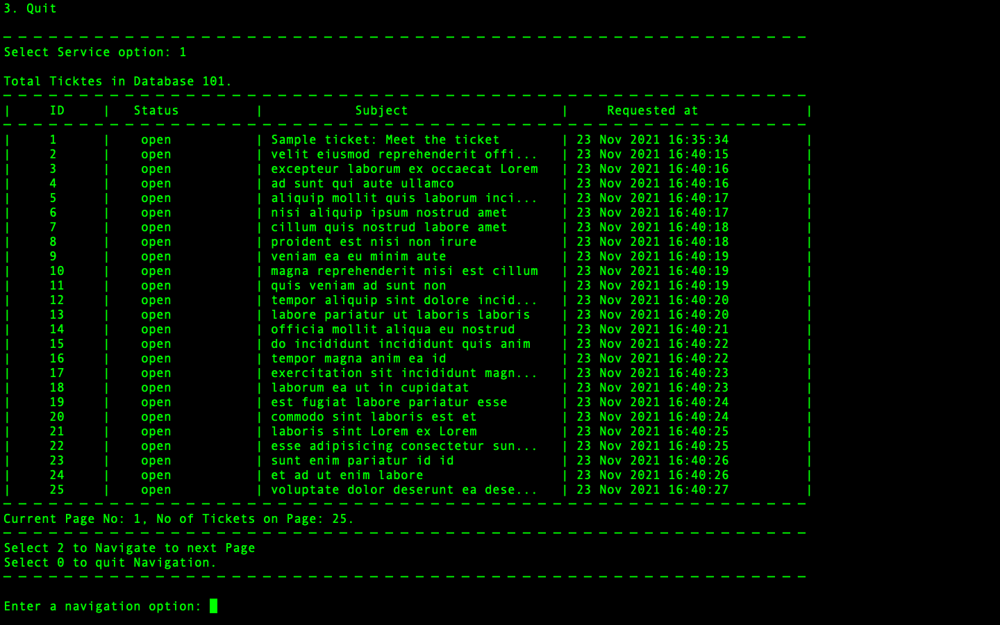
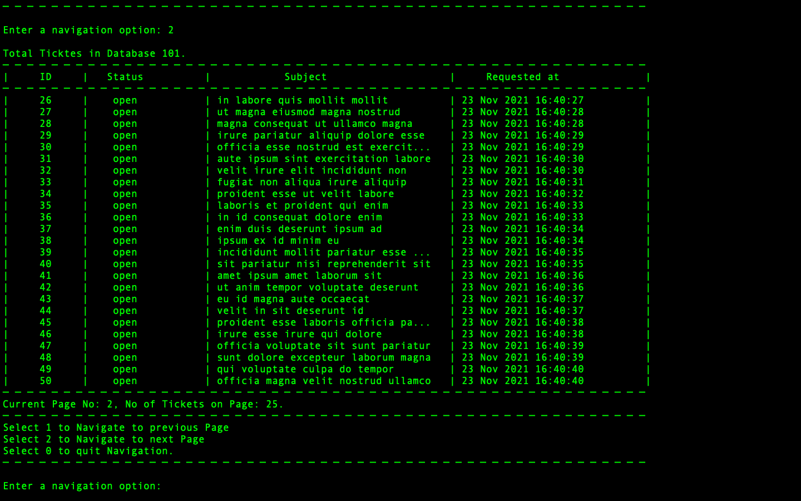
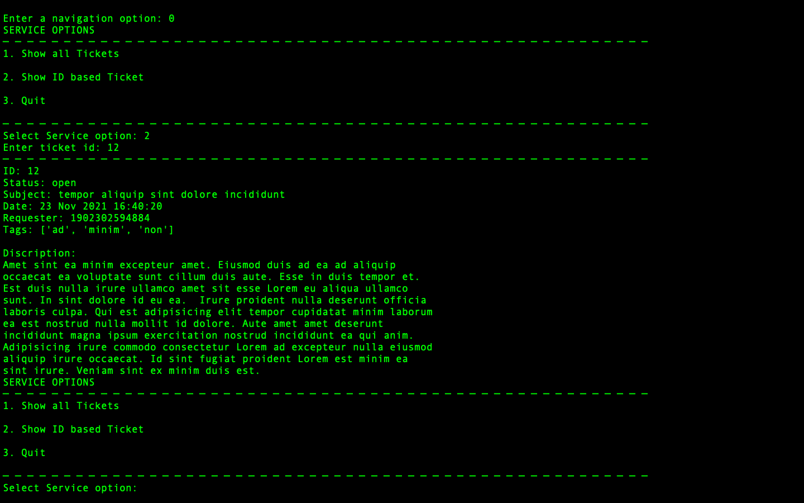

# Zendesk Summer Internship 2022 Assesment

It's a Command line based Ticket Viewer system built using Zendesk service tool that allows the creation and management of support tickets. 

## Key features

* Connect to the Zendesk API
* Request all the tickets for your account
* Display them in a list
* Display individual ticket details 
* Page through tickets when more than 25 are returned

## Getting Started

### Prerequisites

* ```Python 3.9.8```
* ```pip  21.3.1```
* ```Unix Based Operating System```

### Installing

* Run the bash script "InstallPackage.sh" to install required packages. If you are using windows based operating system kindly open the bash script and install the packages manually using python package manager of your choice. 
* Open cred.json and updated you Zendesk login details in that file.Below is the details discripton of each field.

```
{
    "username":"email@email.com",      // In this field you need to provide your email which you use to login to your Zendesk Account    
    "AccessToken":"AsampleTokenGeneated",    // Here, you will be required to put you access token, which you can find under Settings->API->Token access
    "Domain":"zccavkumar"               //Here, Enter the domain name from the URL generated from Zendesk once you login to your Zendesk account. Example : https://<domain>.zendesk.com
}

``` 

### Running the Application
* Clone git repo using below command:-
```
git clone "https://github.com/avkumar19/MyZendeskCode.git"
```
* Move to Directory MyZendeskCode
* If you don't have any tickets currently present in your Zendesk Account. You can load some sample tickets from 'tickets.json' and check the Application.
```
MyZendeskCode % curl https://{subdomain}.zendesk.com/api/v2/imports/tickets/create_many.json -v -u {email_address}/token:{token} -X POST -d @tickets.json -H "Content-Type: application/json"
```
* Now, Lets Run the Application
```
MyZendeskCode % python3 ZendeskAPI/application.py
```
* Rest of the navigation details will be displayed when you run the application. 

* To run the UnitTest and Coverage report please run the bash script "RunCoverage.sh
```
MyZendeskCode % bash RunCoverage.sh
```
* After running the coverage you can view the report from 'htmlcov/index.html' in any web browser

* Note: Some of the Unit Test cases Valid correctness based on tickets from attached 'tickets.json'. For correct results please try running the Tests after loading the tickets from 'tickets.json'. 

## Application Preview

I have shared some screen shots of the Application showcasing all the available features. 
* User Interface (Main Screen) 


* User Interface (Show All Tickets Option with Page Size = 25) 


* User Interface (Show All Tickets : Page 2) 


* User Interface (Show Detailed info with Ticket ID) 

